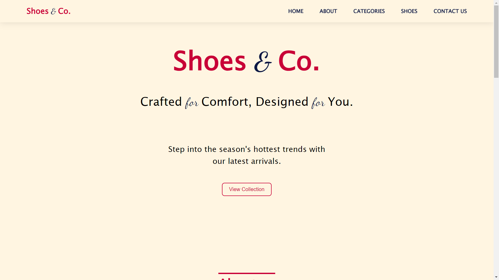

<h2 align="center">
  Gaming Console Hub Landing Page
  <a href="https://shoeandco.netlify.app/" target="_blank">Shoe and Co.</a>  
</h2>

  

## Contents

- [Objective](#objective)
- [About](#about)
- [Features](#features)
- [Technologies-Used](#technologies-used)

## Objective

Create an interactive navigation menu that changes color or style when scrolled or when hovering over a menu item. The navigation menu should have a fixed position and be visible on all pages. Use HTML to structure the menu, CSS to style it, and JavaScript to add interactivity, such as changing the background color or font color of the menu when it is scrolled or when a menu item is hovered over.

## About

The project is a responsive web application designed to showcase a collection of shoes offered by a fictional company called "Shoes & Co." The application aims to provide users with an immersive and visually appealing experience while exploring different categories of shoes.

## Features 

1. Responsive Design: The application is designed to adapt seamlessly to various screen sizes, ensuring an optimal viewing experience across desktops, tablets, and mobile devices.
2. Smooth Scrolling: Implemented smooth scrolling functionality to enhance navigation between different sections of the website, providing users with a fluid browsing experience.
3. Interactive Navbar: Utilized a dynamic navbar that allows users to easily navigate to different sections of the website, enhancing accessibility and user engagement.
4. Engaging Animations: Incorporated fade-in animations for elements within the website, adding a visually appealing touch and creating a more interactive user experience.
5. Scroll-to-Top Button: Included a scroll-to-top button to facilitate quick navigation back to the top of the page, enhancing user convenience and accessibility.

## Technologies-Used

- HTML
- CSS
- JavaScript