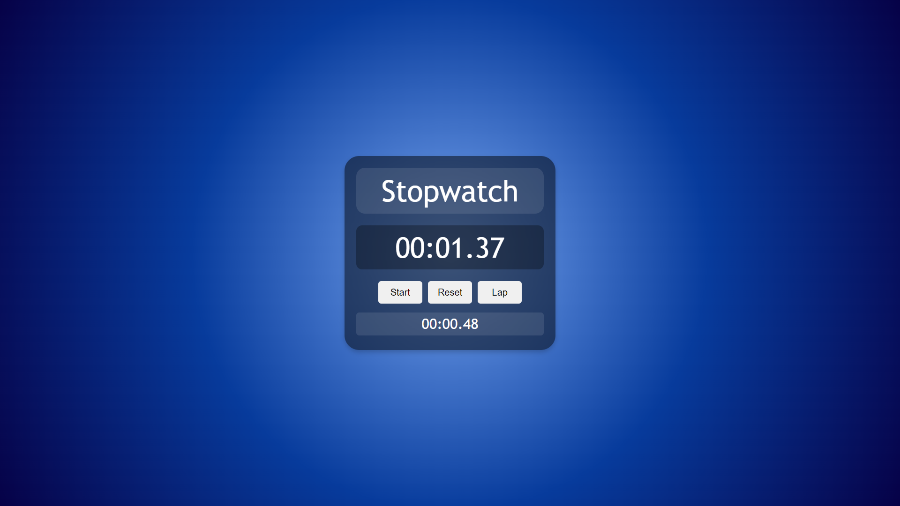

<h2 align="center">
  Stopwatch Web Application 
  <a href="https://stopwatchweb-sk.netlify.app/" target="_blank">Stopwatch Web Application</a>  
</h2>

  

## Contents

- [Objective](#objective)
- [About](#about)
- [Features](#features)
- [Technologies Used](#technologies-used)

## Objective

To build a stopwatch web application using HTML, CSS, and JavaScript. The application will feature a circle with a gradient background, providing a visually appealing design. Users will be able to interact with the stopwatch by starting and resetting it, as well as tracking and displaying lap times. The goal is to create an interactive and user-friendly stopwatch web application that accurately measures and records time intervals.

## About

The project is a web-based stopwatch application designed to provide users with a convenient tool for accurately measuring elapsed time. It offers a visually appealing design with a gradient background circle and intuitive controls for starting and resetting the stopwatch timer. Additionally, users can track and display lap times to record multiple time intervals efficiently.

## Features 

1. Stopwatch Controls: Start and reset the stopwatch timer with intuitive controls.
2. Lap Recording: Record lap times to track multiple time intervals accurately.
3. Visual Design: Features a circle with a gradient background for a visually appealing interface.
4. Real-time Display: The stopwatch timer updates in real-time, providing accurate timing information.
5. User-friendly Interface: Offers a clean and intuitive interface for easy navigation and interaction.

## Technologies Used

- HTML
- CSS
- JavaScript