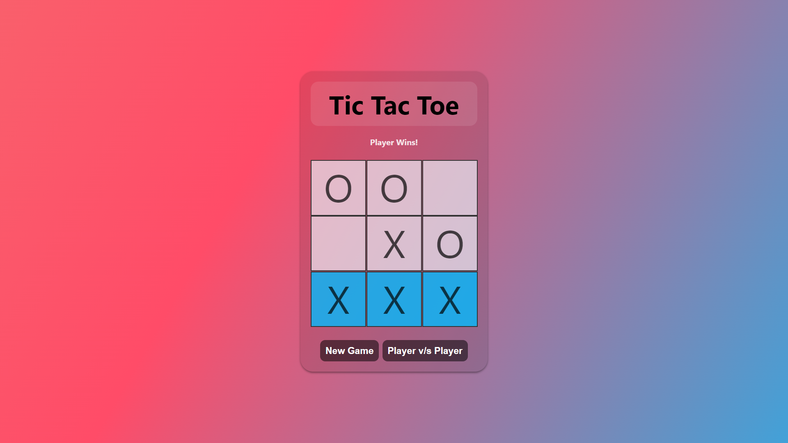

<h2 align="center">
  Tic-Tac-Toe Web Application 
  <a href="https://tictactoeweb-sk.netlify.app/" target="_blank">Tic-Tac-Toe Demo</a>  
</h2>

  

## Contents

- [Objective](#objective)
- [About](#about)
- [Features](#features)
- [Technologies Used](#technologies-used)

## Objective

To build a tic-tac-toe web application using HTML, CSS, and JavaScript. By implementing functions to handle user clicks, track game state, and check for winning conditions, the goal is to create an interactive and engaging tic-tac-toe game. With these technologies and functionalities, users can play against each other or against an AI opponent, aiming to get three markers in a row to win the game.

## About

The project is a web-based tic-tac-toe application designed to provide users with a fun and interactive game experience. It allows users to play either against another player or an AI opponent. The application offers a clean and intuitive interface with visual cues for game state and winning conditions.

## Features 

1. Two Modes: Play against another player or an AI opponent.
2. Game Controls: Intuitive controls for starting a new game and switching between modes.
3. Visual Indicators: Highlight winning cells and display the current player's turn.
4. Real-time Updates: The game board updates in real-time based on player actions.
5. User-friendly Interface: Clean and intuitive design for easy navigation and interaction.

## Technologies Used

- HTML
- CSS
- JavaScript
