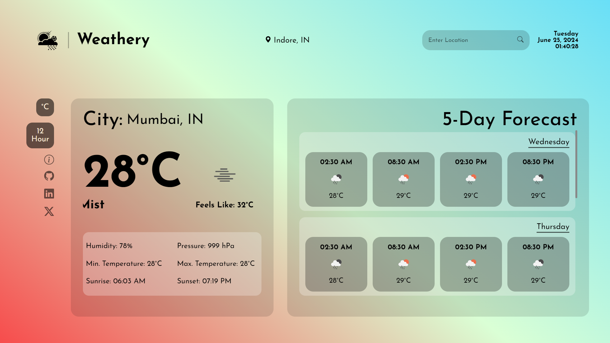

<h2 align="center">
  Weathery - The Weather App 
  <a href="https://weathery-sk.netlify.app/" target="_blank">Weathery Demo</a>  
</h2>

  

## Contents

- [Objective](#objective)
- [About](#about)
- [Features](#features)
- [Technologies Used](#technologies-used)

## Objective
Build a web page that fetches weather data from a weather API based on the user's location or a user-inputted location. Display the current weather conditions, temperature, and other relevant information.

## About

The project is a web-based weather forecast application designed to deliver real-time weather data and forecasts to users. It utilizes the OpenWeatherMap API to fetch weather information based on user-provided location data. The application offers a clean and intuitive interface with visual representations of weather conditions and forecasts.

To enhance user experience, the application provides interactive features such as location-based weather tracking, customizable units and time formats, and real-time updates. Error handling mechanisms ensure that users receive informative messages in case of invalid inputs or API failures.

## Features 

1. Location-based Weather Forecast: Fetches weather data for specified locations.
2. Current Weather Display: Displays current weather conditions including temperature, humidity, pressure, etc.
3. Five-day Forecast: Provides a five-day forecast for the selected location.
4. Hourly Forecast: Detailed hourly forecast data for the next 48 hours.
5. Interactive Map: Visual representation of weather patterns using an interactive map.
6. Search Functionality: Allows users to search for weather information by city name or ZIP code.
7. User Preferences: Option to customize units (e.g., Celsius/Fahrenheit) and time formats.
8. Responsive Design: Ensures seamless experience across various devices and screen sizes.
9. Real-time Updates: Updates weather data and forecasts in real-time.
10. Error Handling: Provides informative error messages for invalid inputs or API failures.

## Technologies Used

- **HTML:** Used for structuring the web pages and content.
- **CSS:** Used for styling the application and enhancing visual appeal.
- **JavaScript:** Used for implementing interactive features and fetching data from the OpenWeatherMap API.
- **OpenWeatherMap API:** Used for retrieving real-time weather data and forecasts based on user inputs.
